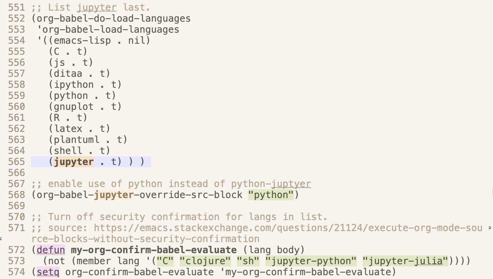
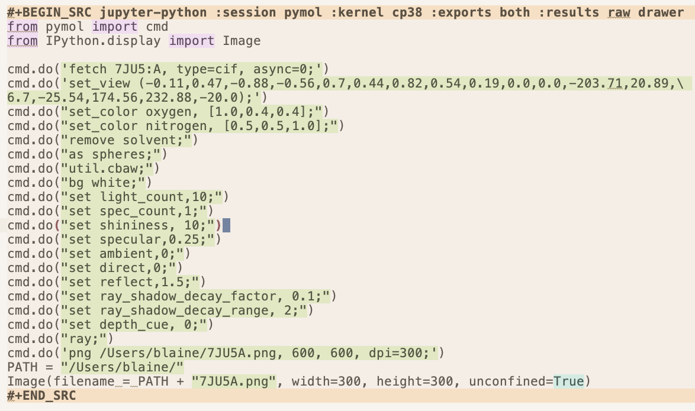

# orgpymolpysnips

## Introduction

This project supports the generation of reproducible molecular images using Org Mode and PyMOL.
It includes a yasnippet library of PyMOL code library written in Python rather than the PyMOL macro language (pml) library.
Each snippet is a code source block for org-mode. 
Org-mode is the scope of this library.
You use the library with Jupyter kernels that can access the Python API of PyMOL.

## Why is this library for org-mode beneficial for biologists?

- Org supports literate programming. The code can be run inside of a Org document and the output images can be displayed
below the code block. The full power of Emacs's editing features are available for editing the flanking prose. 

- A gallery of images can be generated. Such a gallery eases the selection of images for publication.

- The image gallery is also valuable after the publication of a research paper. You can reuse the code to generate images for news releases about the research paper.
It is also useful for making images for review articles, book chapters, web sites, seminars, and wall hanging artwork.

- The org document can be converted into a supplemental materials document for the research paper. 
This document would contain the code needed to generate the images used in the research paper.
Such a document enables readers to reproduce the images in the research paper. 
This capability supports the practice of the FAIR principles and the practice of rigorous science.

- Org documents can be used with the Emacs journal package an electronic laboratory notebook with each day being stored in a separate document. The source block of PyMOL code 

## Features of the library

- Each snippet is in Python and is flanked by org-mode source block code.
- Snippets are divided into 20 categories.
- The categories appear as submenus in the yasnippet pull-down menu for org-mode.
- The snippets are have tabtriggers

## Comparison with using Jupyter

| Features          | Org Mode | Jupyter  |
|:-------------------|:----------:|:----------:|
| Tab triggers      | +        | -        |
| Tab stops         | +        | -        |
| Snippet groups*   | +        | +/-      |
| Parallel sessions | +        | -        |
| Support for editing prose | +++ | + |  
| Pass output data  | +        | -        |
| Rendering speed   | -        | +        |
| Scrolling speed   | -        | +        |

     *Depends on the Jupyter snippet extension being used.

## Requirements

- Emacs
- yasnippets package for Emacs
- org-mode package for Emacs
- org-babel package for Emacs
- Jupyter 
- PyMOL
- a jupyter kernel mapped to the Python interpreter of PyMOL.

## Installation of the snippet library

- Create the directory `~/.emacs.d/snippets/org-mode` for your personal snippets if this directory does not exist yet.
- Download this repo.
- Move the contents of `orgMode` to  `~/.emacs.d/snippets/org-mode`.

## Configuration of the Emacs intitialization file ( e.g., .emacs.el, .emacs, or ./emacs.d/init.el)

## Operation

- Open a org document in Emacs.
- Select under the `YASnippet` pulldown `Reload everything` to load the snippets in an old session of PyMOL.
- Select under the `YASnippet` pulldown `org-mode` and then one of the sub-menus with the prefix `pymolpy-`. Select a snippet to insert it into the org document, or enter the key (== tabtrigger) name in the org document and enter tab to insert the code.
- Enter <tab> to advance through the tab stops. Edit each tab stop as needed. For example, you may need to change the name of the kernel or the color of a chain.
- Place the cursor inside the code block or on the first line of the source block and enter `C-c C-c` to execute the code. The output will appear below.
- You may have to merge code blocks from multiple snippets for complex analyses. The merger has to be done by manual copy and paste.
- You can also access the pymolshortcuts. The file containing the shortcuts can be loaded by running the command `cmd.do("run /Users/blaine/Scripts/PyMOLScripts/pymolshortcuts.py")`. For example, the ambient occlussion shortcut is applied by entering `cmd.do(AO)`.

## Example input source block  
  
Change the kernel name to that for a Python interpreter that has access to the PyMOL API.
The session name is arbitary. 
Each session is independent.

The height and width in the argument for Image() must be given but do not have to be the actual pixel values. 
PyMOL only outputs PNG image files.  
  

  
  
## Example result block  
Fold as many of the code and result blocks to reduce the lag in scrolling the org document in Emacs.
  

  
