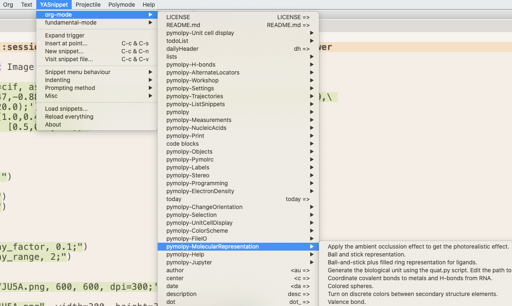
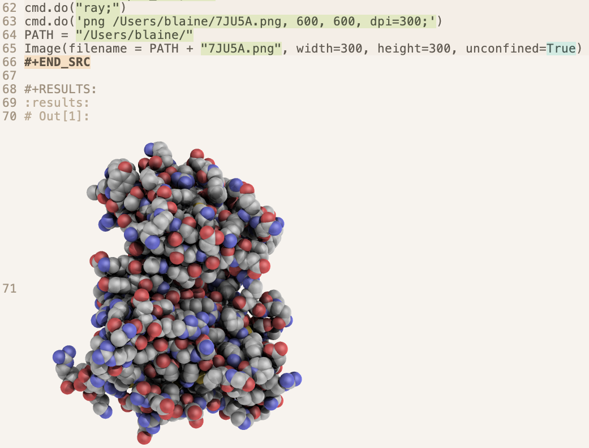

# orgpymolpysnips

## Introduction

This project supports the generation of reproducible molecular images using Org Mode and PyMOL.
It includes a yasnippet library of PyMOL code library written in Python rather than the PyMOL macro language (pml) library.
Each snippet is a code source block for org-mode. 
Org-mode is the scope of this library.
You use the library with Jupyter kernels that can access the Python API of PyMOL.
It is located in the orgMode folder.

A second library in the pythonMode folder lacks the flanking source block lines for org-mode. This package is for use inside of source blocks when Emacs recognizes the scope as being that of Python rather than Org.

## Why is this library for org-mode beneficial for biologists?

- Org supports literate programming. The code can be run inside of a Org document and the output images can be displayed in adjacent buffers or
below the code block. The full power of Emacs's editing features are available for editing the flanking prose. 

- A gallery of images can be generated. Such a gallery eases the selection of images for publication.

- The image gallery is also valuable after the publication of a research paper. You can reuse the code to generate images for news releases about the research paper.
It is also useful for making images for review articles, book chapters, web sites, seminars, and wall hanging artwork.

- The org document can be converted into a supplemental materials document for the research paper. 
This document would contain the code needed to generate the images used in the research paper.
Such a document enables readers to reproduce the images in the research paper. 
This capability supports the practice of the FAIR principles and adds rigor to the science being reported.

- Org documents can be used with the Emacs journal package an electronic laboratory notebook with each day being stored in a separate document. The source blocks of PyMOL code can be included.

- Org supports a more direct and faster path to a PDF of the Org document. This PDF can be navigated much faster than the Org document with all of code unfolded and faster than a Jupyter notebook. This PDF is the document of choice for selecting images for publication.

## Features of the library

- Each snippet is in Python and is flanked by org-mode source block code.
- Snippets are divided into 20 categories.
- The categories appear as submenus in the yasnippet pull-down menu for org-mode.
- The snippets are have tab triggers (called key: in the snippet header) and tab stops (marked with $).


## Comparison with using Jupyter
<div align="center">


| Features          | Org Mode | Jupyter  |
|:-------------------|:----------:|:----------:|
| Tab triggers      | +        | -        |
| Tab stops         | +        | -        |
| Snippet groups*   | +        | +/-      |
| Parallel sessions in the same documents | +        | -        |
| Support for editing prose | +++ | + |  
| Pass output data  | +        | -        |
| Rendering speed   | -        | +        |
| Scrolling speed   | -        | +        |
| Support for export to PDF | +++++ | + |    

     *Depends on the Jupyter snippet extension being used.
</div>


## Requirements

- Emacs
- yasnippets package for Emacs
- org-mode package for Emacs
- Jupyter 
- PyMOL
- a jupyter kernel mapped to the Python interpreter of PyMOL.

## Installation of the snippet library

- Create the directory `~/.emacs.d/snippets/org-mode` for your personal snippets if this directory does not exist yet.
- Create the directory `~/.emacs.d/snippets/python-mode` if this directory does not exist yet.
- Download this repo.
- Move the contents of `orgMode` to  `~/.emacs.d/snippets/org-mode`.
- Move the contents of `pythonMode` to  `~/.emacs.d/snippets/python-mode`.
- If you start a new Emacs session, you should see submenus starting with `pymolpy-` under python-mode and org-mode in the `YASnippet` pulldown menu. 
- If you have a running Emacs session, select `Reload everything` under the `YASnippet` pulldown menu. You often have to repeat two or three times before seeing the new submenus.

## Configuration of the Emacs intitialization file ( e.g., .emacs.el, .emacs, or ./emacs.d/init.el)

My full configuration file can be found [](here).

Org-mode and org-babel are required.
Org babel requires a list of languages.
Jupyter has to be the last language in this list.

```elisp
;; List jupyter last.
(org-babel-do-load-languages
 'org-babel-load-languages
 '((emacs-lisp . nil)
   (C . t)
   (js . t)
   (ditaa . t)
   (ipython . t)
   (python . t)
   (gnuplot . t)
   (R . t)
   (latex . t)
   (plantuml . t)
   (shell . t)
   (jupyter . t) ) )
```

The python-mode folder above contains snippets that can be added inside org-mode source blocks.
The following code enables Emacs to recognize that the interior of a org source block has
a python scope. 
The python-mode submenum should appear in the yasnippets pull-down menu.

```elisp
;; enable use of python instead of python-juptyer
(org-babel-jupyter-override-src-block "python")
```

A security question appears when you evaluate a souce block.
This can be annoying when developing code.
The following code turns off this security question for the listed languages.

```elisp
;; Turn off security confirmation for langs in list.
;; source: https://emacs.stackexchange.com/questions/21124/execute-org-mode-source-blocks-without-security-confirmation
(defun my-org-confirm-babel-evaluate (lang body)
  (not (member lang '("C" "clojure" "sh" "jupyter-python" "jupyter-julia"))))
(setq org-confirm-babel-evaluate 'my-org-confirm-babel-evaluate)
```


## Operation

<p align="center"></p>

- Creat the required Jupyter kernel. Either map one to the PyMOL.app Python interpreter or install PyMOL in a conda env and create a juptyer kernel for that env.
- Start Emacs.
- Open a org document in Emacs.
- Select under the `YASnippet` pulldown `Reload everything` to load the snippets in an old session of PyMOL.
- Select under the `YASnippet` pulldown `org-mode` and then one of the sub-menus with the prefix `pymolpy-`. Select a snippet to insert it into the org document, or enter the key (== tabtrigger) name in the org document and enter tab to insert the code.
- Enter <tab> to advance through the tab stops. Edit each tab stop as needed. For example, you may need to change the name of the kernel or the color of a chain.
- Place the cursor inside the code block or on the first line of the source block and enter `C-c C-c` to execute the code. The output will appear in the results drawer below.
- You may have to merge code blocks from multiple snippets for complex analyses. The merger has to be done by manual copy and paste. You can alternately use snippets from the pythonMode library inside of the code blocks when Emacs recognizes the interior of the code block as being in the python-mode.
- You can also access the [pymolshortcuts](https://github.com/MooersLab/pymolshortcuts/edit/master/README.md). The file containing the shortcuts can be loaded by running the command `cmd.do("run /Users/blaine/Scripts/PyMOLScripts/pymolshortcuts.py")`. For example, the ambient occlussion shortcut is applied by adding the line `cmd.do(AO)` to your source block. This saves spaces because the AO shortcut has 16 lines of code.

## Example input source block  
  
If you use emacs-juptyer, you enter `#+BEGIN_SRC jupyter-python ` on the top lone of the source block.
I found this approach to be fragile to changes in my PATH in my .zshrc file because I have numerous Python interpreters on my system. 
    
Alternatively, you can use org-babel. You will have to specifiy a session and a kernel. Start with  `#+BEGIN_SRC jupyter :session pymol :kernel cp38` .
    
Change the kernel name to that for the Python interpreter that has access to PyMOL's Python API.
The session name is arbitary. 
Each session is independent.
All blocks with the same session name are part of the same session, so they share the same state of Jupyter.
Using different session names for different code blocks is useful testing alternate code blocks in isolation of each other.

The height and width in the argument for Image() must be given but do not have to be the actual pixel values. 
PyMOL only outputs PNG image files.  
  
```python
#+BEGIN_SRC jupyter :session pymol3 :kernel cp38 :exports both :results raw drawer
cmd.do('fetch 7JU5:A, type=cif, async=0;')
cmd.do('set_view (-0.11,0.47,-0.88,-0.56,0.7,0.44,0.82,0.54,0.19,0.0,0.0,-203.71,20.89,\
6.7,-25.54,174.56,232.88,-20.0);')
cmd.do("set_color oxygen, [1.0,0.4,0.4];")
cmd.do("set_color nitrogen, [0.5,0.5,1.0];")
cmd.do("remove solvent;")
cmd.do("as spheres;")
cmd.do("util.cbaw;")
cmd.do("bg white;")
cmd.do("set light_count,10;")
cmd.do("set spec_count,1;")
cmd.do("set shininess, 10;")
cmd.do("set specular,0.25;")
cmd.do("set ambient,0;")
cmd.do("set direct,0;")
cmd.do("set reflect,1.5;")
cmd.do("set ray_shadow_decay_factor, 0.1;")
cmd.do("set ray_shadow_decay_range, 2;")
cmd.do("set depth_cue, 0;")
cmd.do("ray;")
cmd.do('png /Users/blaine/7JU5Aredo.png, 600, 600, dpi=300;')
PATH = "/Users/blaine/"
Image(filename = PATH + "7JU5Aredo.png", width=300, height=300, unconfined=True)
#+END_SRC
```

## Example result drawer when using `jupyter` from org-babel's `ob-jupyter`.
  
Click on the link to the file to open the png file in another buffer.    
    
```emacs    
#+RESULTS:
:RESULTS:
#+attr_org: :width 300 :height 300
[[file:./.ob-jupyter/a113aa80d474a45c062e5ef96056e481c078aa95.png]]
:END:
```     
    
## Example result drawer when using `jupyter-python` from emacs-jupyter.
  
<p align="center"></p>
    
The display of the PNG output file directly in the org file causes the file to lag during scrolling. Fold as many of the code and result blocks as possible to reduce the lag during scrolling.
    
  
### Work arounds for lag in scrolling Org files are large numbers of images
    
- Fold all of the code blocks and results drawers. Open only the ones that you are currently inspecting.
    
- Alternatively, do not return the images to a results drawer (change the top line of the org-mode source block accordingly).
Instead, import the image to a LaTeX figure environment and wait to see the image after compiling the PDF. Org can interpret LaTeX code directly. I made the following snippet file called latex-env-fig that shows up in the org-mode sub-menu under the latex-env sub-sub-menu of the YAsnippet pull-down menu. The `$` signs mark the sites of tab stops. This and several other members of the latex-env group are included in the `orgMode` folder.
    
```latex
# -*- mode: snippet -*-
# contributor: Blaine Mooers, bmooers1@gmail.com, github.com/MooersLab
# name: Latex for figure env
# group: latex-envs
# key: fig
# --
\begin{figure}
\begin{center}
    \includegraphics[width={${1:0.86}\textwidth, angle=0]{${2:/Users/blaine/7JU5A.png}}
\end{center}
\caption{${3:RET kinase, PDB-ID: 7JU5}}
\end{figure}
$0
```
